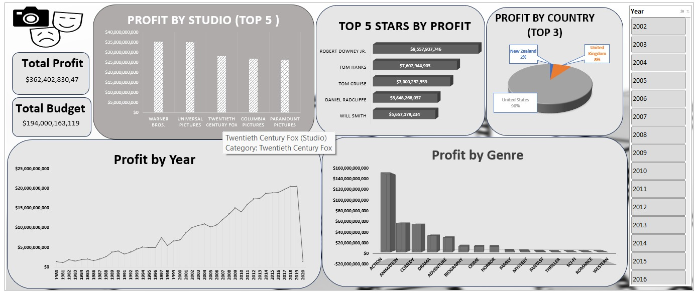

# 🎬 Film Production Profitability Dashboard

## 📌 Project Overview

This project analyzes film production data to identify the most profitable studios, top-performing actors, and country-wise production distribution. The dashboard helps production companies make data-driven decisions regarding investments, casting, and market focus.

**Dashboard Preview:**

---

## 🛠 Tools Used

- **Excel** – Data cleaning and preparation  
- **Power BI** – Data visualization and dashboard creation  

---

## 📂 Project Steps

1. **Data Cleaning** – Removed duplicates, handled missing values, standardized formats  
2. **Data Analysis** – Calculated profit, ROI, and aggregated by studio, actor, and country  
3. **Data Visualization** – Designed interactive charts and KPIs  
4. **Dashboard Creation** – Built a unified view for key metrics  

---

## 📊 Key Questions

- Which studios generate the highest profit?  
- Who are the top 5 most profitable actors?  
- Which countries contribute most to film production?  
- How do budget and profit correlate across studios?  

---

## 📈 Dashboard Insights

### 1. Profit by Studio (Top 5)
- **Warner Bros.** leads with the highest total profit  
- **Universal Pictures**, **Twentieth Century Fox**, **Columbia Pictures**, and **Paramount Pictures** follow  
- Total profit across top studios: **$362B**  
- Total budget across top studios: **$194B**

### 2. Top 5 Stars by Profit
| Star | Total Profit |
|------|---------------|
| Robert Downey Jr. | $9.56B |
| Tom Hanks | $7.61B |
| Tom Cruise | $7.00B |
| Daniel Radcliffe | $5.85B |
| Will Smith | $5.66B |

### 3. Country Breakdown
- **United States** dominates film production (90% of movies)  
- Other contributing countries: New Zealand, United Kingdom, France, Germany, Italy, Spain, and others  

---

## 🔍 Key Findings

- **Warner Bros.** is the most profitable studio  
- **Robert Downey Jr.** is the highest-grossing actor, largely due to Marvel franchises  
- The **United States** remains the dominant production hub  
- Top 5 studios collectively generated over **$362B** in profit  

---

## 📁 Project Files

- `Dashboard.jpeg` – Dashboard screenshot  
- `Movie_Data.xlsx` – Raw and cleaned dataset  
- `Film_Profitability.pbix` – Power BI file  

---

## 👩‍💻 Author

**Your Name** – Ali Soliman
[GitHub Profile Link] | [LinkedIn Profile Link]

---

## ⭐ Show Your Support

If you found this project useful, give it a ⭐ on GitHub!# Film-TV-Production-Dashboard
A movie box office dashboard analyzing budget, domestic &amp; worldwide gross, profit/loss, ratings, and genres. Helps production companies identify profitable film categories, compare performance, and make data-driven decisions
